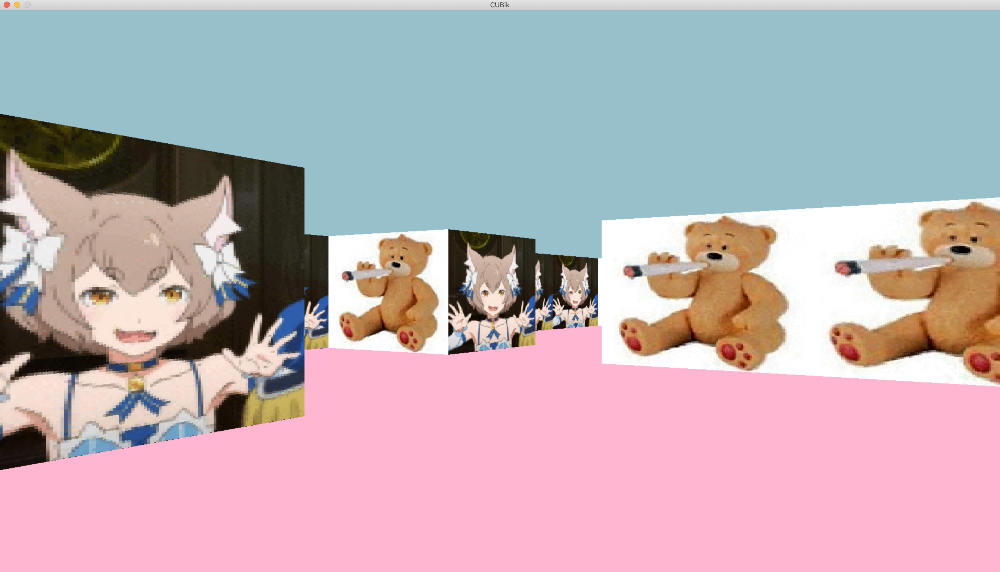

## cub3d

Raycasting game (almost a game) from a first-person perspective.

with [Vova](https://github.com/delakruel/) :)

### Compiling

* To compile
	- `make`
* To remove objects:
	- `make clean`
* To remove objects and binary file (program):
	- `make fclean`
* To re-compile:
	- `make re`

### Executing

`./cub3d maps/map.cub`

* ``WASD`` to move, ``Left/Right`` directional keys to rotate camera
* ``ESC`` to quit

What it looks like:

